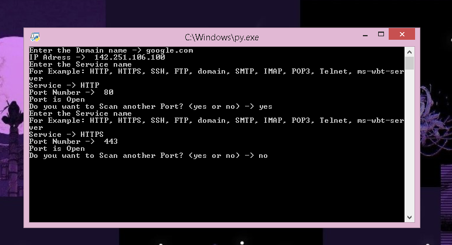

# 🔐 Port-Check

### 🌐 A Python-Based Network Port Connectivity Tool

<p align="center">
  <b>🔎 Explore • 🌐 Connect • 🛡️ Learn</b>
</p>

---

## 🚀 About the Project

**Port-Check** is a Python networking project that checks whether a specified port is accessible on a given domain .

The project was created to learn the fundamentals of **computer networking, socket programming, and basic cybersecurity concepts** using Python.

---

## ✨ Features

* 🌐 Domain name input
* 🔌 TCP port connectivity checking
* ⏱️ Connection timeout handling
* ⚠️ Exception handling
* 🐍 Built using Python's `socket` library
* 💻 Simple command-line interface

---

## 🛠️ Tech Stack

| Technology | Purpose                   |
| ---------- | ------------------------- |
| 🐍 Python  | Core programming language |
| 🔌 Socket  | Network communication     |
| 🌐 TCP/IP  | Port connectivity         |

---

## ▶️ How to Run

### 1️⃣ Clone the repository

```bash
git clone REPOSITORY_LINK
```

### 2️⃣ Open the project folder

```bash
cd Port-Check
```

### 3️⃣ Run the program

```bash
python Port-Check.py
```

---

## 💻 Example

```text
╔══════════════════════════════════╗
║          🔐 Port-Check            ║
╚══════════════════════════════════╝

Enter domain: google.com
Enter Service: HTTP

[+] Port is accessible
```

---
##<h2>📸 Project Preview</h2>




## 🧠 What I Learned

While building Port-Check, I learned about:

* 🔹 Python socket programming
* 🔹 TCP connections
* 🔹 Domain name resolution
* 🔹 Network ports
* 🔹 Connection timeouts
* 🔹 Exception handling
* 🔹 Basic network troubleshooting

---

## ⚠️ Disclaimer

This project is created for **educational purposes**.

Only scan domains, IP addresses, and systems that you own or have explicit permission to test.

---

### ⭐ If you find this project useful, consider giving it a star!
